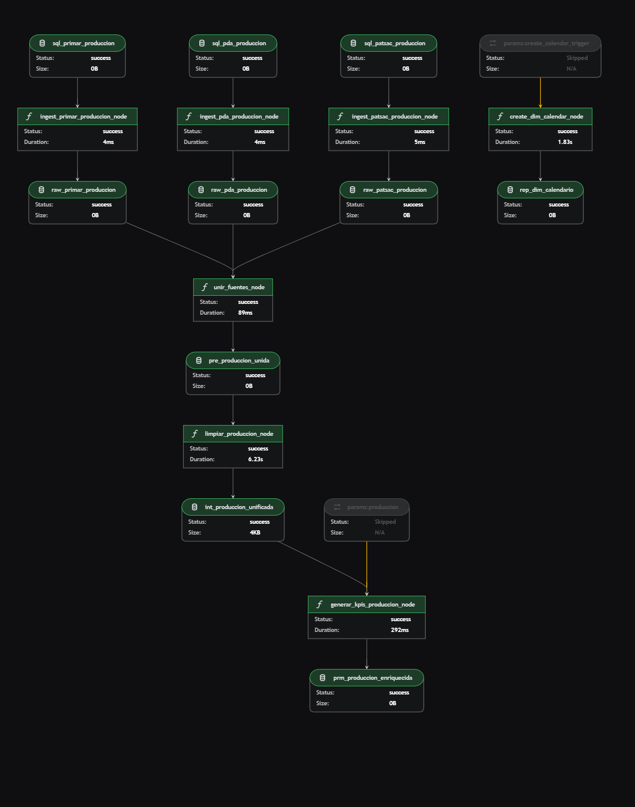

# Lomar-Stack

[](https://kedro.org)

Proyecto de integración de pipelines de datos basados en Kedro y PySpark, preparado para ejecución local, en contenedores y orquestado con Airflow. Este repositorio contiene pipelines modulares para ingestión, procesamiento, feature engineering y reporting.

**Visualización de KPIs**

* **Dashboard Interactivo:** [Acceder al Reporte en Power BI Pro](https://app.powerbi.com/view?r=eyJrIjoiNGRlMThhMTktZTcyOC00YmE4LWI2YTYtNmFjNWNlMThlNjM1IiwidCI6ImRmNGI2MzcyLWEwM2EtNDZmMC05YmY1LTdmOGQzNzhhMzMzNCIsImMiOjR9)

**Estructura de los pipelines**

- Los pipelines están organizados por responsabilidades: `data_ingestion`, `data_processing`, `feature_engineering`, `reporting`.
- Para visualizar la estructura y dependencias de los pipelines con Kedro, incluya la imagen generada por Kedro-Viz en `data/08_reporting/kedro-viz.png`.



Tecnologías y detalles por componente

**Kedro**:
- Arquitectura de pipelines modular y reusable mediante `Pipeline` y `node`.
- Uso de `catalog.yml` para declarar datasets y orígenes (local, GCS).
- Optimización de nodos: dividir lógica en nodes pequeños y deterministas, usar `parameters` para evitar hardcode, habilitar `kedro.io` caching cuando aplique.

**PySpark**:
- Lectura/escritura en formato Parquet para eficiencia y compatibilidad con particionado.
- Optimización en nodos PySpark:
	- Particionado por columnas de alta cardinalidad cuando sea apropiado.
	- Evitar shuffles innecesarios: preferir map-side operations y broadcast joins cuando una tabla es pequeña.
	- Cache/persist selectivo en memoria para reutilización inter-nodos.
	- Uso de `coalesce`/`repartition` controlado antes de escribir para evitar archivos pequeños.
	- Aplicar filtros y proyecciones lo antes posible (predicate pushdown).

**Docker**:
- Contenerización reproducible: `Dockerfile` y `docker-compose.yml` para entornos de desarrollo y pruebas.
- Recomendación: usar imágenes que contengan la versión de Python y Spark compatibles; fijar versiones para reproducibilidad.

**Airflow (orquestación)**:
- Orquestación de ejecución de pipelines mediante DAGs que llaman a comandos `kedro run` o tareas que lanzan jobs Spark.
- Buenas prácticas: retries configurados, SLA, sensores para dependencias externas, y logs centralizados.

**Google Cloud Storage (bucket) — almacenamiento de .parquet**:
- Uso del bucket para persistencia de datasets intermedios y resultados finales (`.parquet`).
- Configurar IAM y variables de entorno en `conf/local/` para credenciales seguras.

Optimización, orquestación y reproducibilidad

- Orquestación: diseñar DAGs Airflow con tareas idempotentes y checkpoints. Separar tareas de ingestión, transformación y reporting.
- Reproducibilidad:
	- Fijar versiones en `requirements.txt`/`pyproject.toml`.
	- Mantener `conf/base` y `conf/local` para parámetros de entorno.
	- Versionado de datos (DVC o snapshots en GCS) y metadata en el catálogo.
- Optimización de recursos:
	- Ajustar `spark.executor.memory` / `spark.executor.cores` según tamaño de datasets.
	- Monitorizar tiempos y perfiles de ejecución; aplicar caching y reducción de IO cuando proceda.

Uso de WSL (Windows Subsystem for Linux)

- Para desarrolladores en Windows se recomienda WSL2 con Docker Desktop en modo WSL intégrado:
	- Habilitar WSL2 y usar una distribución Linux (ej. Ubuntu).
	- Montar el repositorio dentro del sistema de archivos de WSL (`/home/<user>/...`) para evitar latencias con win32.
	- Ajustar recursos de Docker (memoria/CPUs) según carga de Spark local.

Detalles técnicos relevantes por pipeline

- `data_ingestion`:
	- Conectores a fuente (APIs, buckets), validación de esquemas y muestreo.
	- Guardar raw en Parquet particionado por fecha.
- `data_processing`:
	- Transformaciones en Spark: normalización, joins y enriquecimiento.
	- Checkpoints y pruebas unitarias por transformaciones.
- `feature_engineering`:
	- Cálculo de features en Spark con pipelines reproducibles; almacenar en `04_feature/`.
	- Documentar parámetros y ventana temporal.
- `reporting`:
	- Agregaciones finales y generación de datasets listos para visualización.
	- Publicación de KPIs y paneles (Power BI) leyendo desde Parquet en GCS.

Cómo ejecutar (resumen)

```
# Instalar dependencias
pip install -r requirements.txt

# Ejecutar Kedro
kedro run

# Correr tests
pytest

# Ejecutar en Docker (ejemplo)
docker-compose up --build
```

**Buenas prácticas y recomendaciones**

- Mantener nodes pequeños y probados unitariamente.
- Usar parámetros en `conf` y no hardcodear rutas/credenciales.
- Añadir métricas y traces para cada nodo (duración, filas procesadas).
- Ejecutar profiling en jobs largos y aplicar optimizaciones iterativas.

**Seguridad y gestión de credenciales**

Es importante proteger las credenciales y rutas a ficheros sensibles que usa el proyecto (por ejemplo el JSON de cuenta de servicio de GCP que se referencia en `src/lomar_stack/hooks.py`). A continuación se detallan buenas prácticas y opciones de despliegue:

- No incluir el JSON en el repositorio: añada el nombre del fichero al `.gitignore` y nunca haga commit del fichero real.
- Uso de `GCP_KEY_PATH`: el hook busca la variable de entorno `GCP_KEY_PATH` y por defecto usa `lomar-bibucket-b85f25ba9058.json`. En entornos con contenedores, monte el JSON como volumen o use secretos del orquestador.

Ejemplo (modo local / Docker): montar el JSON en el contenedor y pasar la variable de entorno:

```bash
# Montar el fichero y exportar la variable
docker run -e GCP_KEY_PATH=/secrets/lomar-bibucket.json -v /local/keys/lomar-bibucket.json:/secrets/lomar-bibucket.json ...
```
Notas sobre `hooks.py`

- `src/lomar_stack/hooks.py` carga `GCP_KEY_PATH` y construye una ruta `json_key` que luego se establece en la configuración Spark como `spark.hadoop.google.cloud.auth.service.account.json.keyfile`.
- Esto implica que Spark necesita acceso al fichero en la ruta pasada; en entornos distribuidos (Spark en cluster) asegúrese de que el fichero sea accesible desde los nodos ejecutores o utilice credenciales soportadas por la plataforma (ADC, secretos de cluster).


